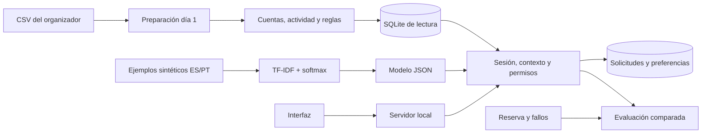

# Campañas relevantes y atención de Cuenta de Ahorro

Aplicación local cuyo recorrido principal es **seleccionar clientes, explicar inclusiones y exclusiones, y preparar una lista de campaña confirmada**. El cliente consulta su información y recibe atención en español y portugués. Incluye un clasificador de intenciones entrenado, fuentes verificables y acciones confirmadas. Alcance: **Cuenta Ahorro, Colombia, análisis histórico del 1 de marzo de 2026 a las 12:00**, con hora de Bogotá asumida para timestamps sin zona.

La coincidencia con los filtros **no demuestra beneficio financiero ni inactividad real**. No hay condiciones comerciales aprobadas en el catálogo. Las consultas que las requieren preparan una solicitud en una cola local de atención. Las listas son locales; no hay un adaptador de distribución de publicidad ni conexión con empleados reales.

## Ejecutar

Requiere Python 3.11 o posterior y NumPy. En esta máquina ya existe el runtime de Codex con NumPy instalado. Si `python` no está disponible, usa PowerShell:

```powershell
$ProjectPython = "$env:USERPROFILE\.cache\codex-runtimes\codex-primary-runtime\dependencies\python\python.exe"
& $ProjectPython scripts/serve.py
```

Con Python disponible en el PATH, reconstruye desde la raíz del repositorio:

```powershell
python -m pip install -r requirements.txt
python scripts/day1.py build
python scripts/day1.py verify
python scripts/phase2.py build
python scripts/phase2.py verify
python scripts/build_scenarios.py
python -m unittest discover -s tests -v
python scripts/evaluate.py --repeat 2 --regression-run
python scripts/serve.py
```

La preparación lee millones de filas y puede tardar varios minutos. Si los artefactos están preparados y verificados, basta `python scripts/serve.py`. Abre **http://127.0.0.1:8002**. Las credenciales están en el archivo privado `outputs/app/access_credentials.json`. `operador` revisa campañas, audiencias y casos; `escenario01` a `escenario13` acceden a sus propios datos. Se conservan `cliente1` a `cliente3` y sus contraseñas anteriores. El backend asigna roles y clientes; no se elige una identidad desde la interfaz.

El modelo final en `outputs/models/intent.json` permanece congelado. Si sólo se conserva el código sin artefactos, `python scripts/train_intents.py` permite reconstruirlo a partir del corpus del equipo; esa ejecución produce otra versión y exige documentar su evaluación, sin ajustar usando la reserva expuesta.

El servidor admite `--port`, `--database`, `--model`, `--state`, `--credentials` y `--router hybrid|learned|baseline`. El modo predeterminado es `hybrid`, elegido con desarrollo antes de evaluar la reserva. No necesita API keys ni servicios externos. Ctrl+C detiene el servidor.

La instancia entregada en esta máquina está en **http://127.0.0.1:8002**, porque el puerto 8000 estaba ocupado. Para relanzarla usa `python scripts/serve.py --port 8002` o `& $ProjectPython scripts/serve.py --port 8002`.

`data/`, `docs/` y `outputs/` están excluidos de Git. Al clonar, copia los datos y documentos del organizador por separado. Los CSV originales nunca se modifican. Los ejemplos incluidos en `datasets/` son sintéticos, redactados por el equipo. No publiques credenciales ni bases de estado.

## Revisar campañas y clientes

1. Ingresa como `operador`. La pantalla principal muestra evaluados, seleccionados, excluidos y motivos. El catálogo tiene cinco campañas del alcance; una está admitida por las reglas y la fecha de análisis. Filtra decisiones y motivos, recorre páginas y abre el detalle de una decisión.
2. **Preparar lista** muestra la audiencia completa; **Confirmar preparación** guarda todos sus destinatarios dentro de una transacción y comprueba los IDs guardados. El comprobante y la descarga CSV sólo están disponibles para su operador. No se envía publicidad.
3. Consulta **Casos de revisión**. El catálogo elige de forma reproducible 13 clientes distintos de los datos del organizador: selección, actividad reciente, falta de consentimiento, segmento, límites de 7/30 días, falta de cuenta, cuenta incoherente, perfil futuro, actividad previa desconocida, estado de cuenta, movimiento reciente en cuarentena y baja confirmada de publicidad.
4. Ingresa como `escenario01` para ver un candidato con historial; `escenario02` tiene actividad reciente; `escenario03` carece de consentimiento. **Mi información** muestra cuentas coherentes y hasta cinco movimientos aprobados conocidos, con fecha, tipo e IDs. **Atención** conserva las consultas y permite pedir aclaración a un asesor.

Los datos son fijos. «Últimos movimientos» significa **los últimos registros confiables conocidos hasta el corte acordado**, no actividad de hoy. No se fabrican transacciones ni clientes para completar ejemplos. La actualización se comprueba mediante fixtures separadas y etiquetadas en las pruebas; no es una fuente en vivo.

Trece perfiles amplían la inspección manual, pero no garantizan todos los comportamientos. La selección se verifica sobre la población completa de Colombia y la atención mantiene su evaluación bilingüe separada.

## Revisar la atención

1. Ingresa y consulta «Quiero consultar mis cuentas de ahorro», «Quiero consultar mi actividad reciente» y «¿Qué campaña de ahorro puedo consultar?».
2. Pregunta «¿Cuáles son las tasas y comisiones de la campaña?». Revisa la solicitud propuesta y pulsa **Confirmar** o **Cancelar**. Solo se muestra un comprobante después de guardar y leer la solicitud.
3. Cambia a portugués: «Quero consultar minhas contas de poupança» y «Quero falar com um assessor».
4. «No quiero recibir publicidad» propone una preferencia local. Confirmarla excluye al cliente de la audiencia del operador y conserva la atención solicitada por el cliente.

Una solicitud `pending` está registrada en una cola simulada; no significa que un empleado resolvió el problema bancario.

## Cómo funciona el código



| Archivo | Responsabilidad |
|---|---|
| `config/project.json` | Alcance, reglas de selección, fecha y supuestos históricos |
| `src/campaigns/prepare.py` | Clientes, campañas y envíos; contratos, calidad y origen |
| `src/campaigns/phase2.py` | Cuentas, actividad y selección; recalcula todas las decisiones al verificar |
| `src/campaigns/store.py` | Lecturas mínimas y rechazo de una base reemplazada hasta reiniciar |
| `src/campaigns/intents.py` | Clasificador entrenado, baseline por palabras y combinación híbrida |
| `src/campaigns/policy.py` | Permisos, consentimiento, fechas y frecuencia fuera del modelo |
| `src/campaigns/service.py` | Conversación, respuestas fundamentadas, aclaraciones y acciones confirmadas |
| `src/campaigns/operations.py` | Selección del operador, preparación confirmada, comprobantes y exportación local |
| `src/campaigns/scenarios.py` | Elección reproducible de perfiles originales con condiciones distintas |
| `src/campaigns/server.py` | HTTP local, validación de peticiones y asignación confiable de accesos |
| `web/index.html` | Centro de campañas, ficha de cliente y atención contextual bilingüe |
| `src/campaigns/evaluation.py` | Comparación reservada y comprobación de resultados persistidos |

La consulta pasa primero por autenticación y permisos. El clasificador propone una intención; el flujo decide qué datos consultar. Las respuestas usan plantillas y registros permitidos. El modelo no concede permisos ni inventa condiciones financieras. Las respuestas y el contexto guardado conservan evidencia y eventos de herramientas.

Una acción pendiente tiene una clave generada por el servidor. La confirmación vuelve a comprobar permisos y escribe dentro de una transacción SQLite. La lectura posterior verifica el resultado antes de anunciarlo. La idempotencia evita duplicar solicitudes al reintentar. Un fallo revierte la transacción y conserva el pendiente para reintento explícito.

El traslado guarda solicitud, hechos comprobados, acciones, evidencia, preguntas pendientes y conversación. La baja de publicidad es una capa local sobre la audiencia preparada; no altera el dataset.

La preparación de listas funciona sin conversación. `CampaignOperations` exige una sesión de operador, calcula todos los pares seleccionados y entrega una propuesta con firma de datos, configuración y destinatarios. Al confirmar, vuelve a calcular la audiencia, guarda lista y miembros, verifica sus identidades y metadatos, y publica el comprobante. Una baja posterior o un cambio de reglas invalida el comprobante para exportación (`needs_refresh`). Los reintentos con la misma clave devuelven el mismo lote, sin duplicarlo.

## Selección y datos

La campaña `CMP-PHK8DTE4KLJO` es de reactivación, segmento Basic y canal Voice. El catálogo la marca `Completed`; una excepción explícita permite reproducirla dentro de su ventana. No hay prueba de su estado histórico real.

La regla exige al menos una cuenta coherente con estado `Active` en la instantánea, actividad aprobada conocida antes de la demo y ningún movimiento observable en los últimos 30 días. Registros recientes incoherentes o disponibles después de la demo bloquean esa cuenta. El criterio es por cuenta: otra cuenta reciente del mismo cliente no prueba ni descarta inactividad total.

El selector actual está diseñado para Reactivation. Cambiar el objetivo de campaña requiere definir y probar una nueva política; editar un campo de configuración no generaliza sus reglas.

Perfil y consentimiento son instantáneas; no existen todos sus eventos históricos. La disponibilidad se aproxima al día de procesamiento. Se excluyen eventos futuros y cuentas con fechas incoherentes. No se proyectan saldo, número de cuenta ni tasa del producto, cuya semántica histórica o unidad no está verificada.

La audiencia tiene **2.021 pares candidatos entre 45.251 clientes de Colombia**. Los 1.148 del día 1 usaban otras reglas; la diferencia no mide una mejora comercial. Los motivos de exclusión se superponen.

La evidencia de demanda se reproduce con `python scripts/problem_evidence.py`: 686.296 interacciones en total y 123.990 de Colombia con fechas coherentes disponibles en la demo. Entre estas últimas hay 27.238 de categoría Producto, 9.894 Comercial y 43.394 marcadas para seguimiento. Esas categorías respaldan consultas y seguimiento bancario generales, sin probar demanda por esta campaña concreta. Las referencias `mentioned_products` no tienen dueño coherente al cruzarlas con productos; no se utilizan para afirmar demanda específica de ahorro. El alcance de ahorro se eligió por decisión del proyecto, catálogo y cuentas disponibles.

Las 171.321 transcripciones suministradas están en español y sólo tienen 546 textos distintos, con marcadores de plantilla. Esto justifica preparar ejemplos bilingües del equipo en lugar de tratar las transcripciones como etiquetas diversas y fiables. `outputs/problem_evidence/` conserva agregados, calidad y hashes de 2.196 archivos; no exporta conversaciones ni IDs individuales.

## Evaluación

TF-IDF de palabras y caracteres alimenta una regresión softmax local. Hay 324 ejemplos de entrenamiento y 36 de desarrollo, con ES/PT juntos por familia. Vocabulario, IDF y pesos usan solo entrenamiento. Umbrales fijados con desarrollo: confianza 0,30, margen 0,10, cobertura léxica 0,08. El híbrido informa modelo, regla explícita o respaldo; sus resultados no se atribuyen íntegramente a ML.

La reserva independiente del equipo tiene **48 casos, 24 familias bilingües**, congelados antes de comparar. Veinte casos tienen juicio específico de intención; los demás verifican políticas y fallos. Las etiquetas no están validadas por el banco. La separación por familias y texto exacto ayuda a prevenir fuga; no prueba independencia semántica absoluta.

La primera comparación midió intención baseline 80%, aprendido 85%, híbrido 90%. El flujo híbrido pasó **44/48**; esos fallos se conservan. Las correcciones posteriores del flujo pasaron **48/48 en regresión**, con clasificador y umbrales congelados. Esa repetición no es una nueva evaluación independiente.

La verificación global final pasó **79 pruebas**, incluidas 20 de selección, listas, fallos y HTTP y cinco de perfiles reproducibles. En regresión, el híbrido resolvió automáticamente 16/38 casos únicos dentro del alcance y realizó los 6/6 traslados requeridos. Los otros casos pueden pasar por una aclaración, rechazo o fallo controlado; 48/48 no significa que todos se resolvieron automáticamente. Se observaron cero resultados inseguros en 288 ejecuciones entre las tres variantes y sus repeticiones.

| Evidencia | Uso |
|---|---|
| `outputs/day1/` | Catálogo, calidad, selección básica y hashes |
| `outputs/viability_review/` | Revisión adicional de datos completos |
| `outputs/problem_evidence/` | Demanda por categorías, fechas y país; límites de referencias y lengua |
| `outputs/phase2/` | Audiencia, SQLite, calidad y verificación completa |
| `outputs/scenarios/` | Trece perfiles originales, condiciones esperadas y evidencia histórica |
| `outputs/verification/requirements_http_review.json` | Revisión independiente de los trece accesos, datos y permisos HTTP |
| `outputs/models/intent.json` | Pesos, separación, métricas y hashes |
| `outputs/evaluation_first_final/` | Primera comparación preservada, incluidos fallos |
| `outputs/evaluation/` | Regresión, resultados, transcripciones, latencia y costos |
| `docs/final_requirements.json` | Requisitos del PDF; no declara cumplimiento por sí sola |

Las métricas distinguen resolución automática segura sobre todos los casos dentro del alcance, automatización intentada, contención, calidad de traslado y resultados inseguros. Se ejecutan dos repeticiones y se informan muestras ES/PT y segmentos. Cero errores inseguros observados no implica riesgo cero. La latencia final suma todos los turnos de servicio del caso, con verificaciones internas; excluye preparación de fixtures y rúbrica, red bancaria y espera humana. La primera medición incluía sobrecarga de evaluación y no debe compararse con la corregida.

APIs externas cuestan USD 0; hardware, energía y operación local no están valorizados. El costo por resolución es indefinido cuando no hay resoluciones. No se ha medido conversión, ahorro comercial ni mejora de producción.

## Actualización y operación

Detén el servidor antes de actualizar datos o reglas. Reconstruye y verifica día 1 si cambian clientes, campañas o envíos; fase 2 si cambian productos, transacciones o reglas del proyecto. Después ejecuta `scripts/build_scenarios.py` para actualizar el catálogo. Se comprueban hashes e inventarios. Las pruebas incluyen cargas repetidas, llegada tardía y claves contradictorias dentro/fuera del alcance. El archivo temporal se publica tras validar. Reinicia para cargar la versión nueva; las acciones pendientes de una versión anterior se rechazan. Si cambia la identidad asignada a un usuario de escenario, utiliza archivos de estado y credenciales nuevos; no reasignes un acceso existente a otro cliente.

Es un único proceso local, con bloqueo para operaciones de estado; no se ha ensayado capacidad bancaria. Mensajes: hasta 2.000 caracteres. Sesiones: 30 minutos reales, independientes de la fecha histórica. Consultas SQL parametrizadas. Reintentos automáticos de herramientas: cero; el usuario puede reintentar explícitamente con la misma clave. Fallar nunca autoriza un envío.

Para operación real faltan identidad institucional, términos y políticas aprobados, revisión humana de etiquetas y reglas, integraciones autorizadas, TLS, gestión de secretos, monitoreo y pruebas de carga. La auditoría local registra acciones/resultados y la evaluación conserva tiempos/transcripciones. No se exportan datos a modelos externos.

Retención local: últimos 12 mensajes por conversación; las sesiones vencen en 30 minutos. Solicitudes, preferencias, listas y auditoría permanecen hasta eliminar el estado. Con el servidor detenido, archiva o elimina manualmente estado y credenciales tras los ensayos según las reglas del organizador. Esto elimina los registros locales, sin afectar los CSV. La operación real necesita una política de retención y borrado aprobada.
