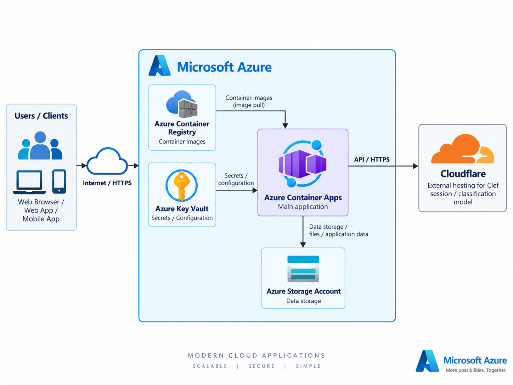
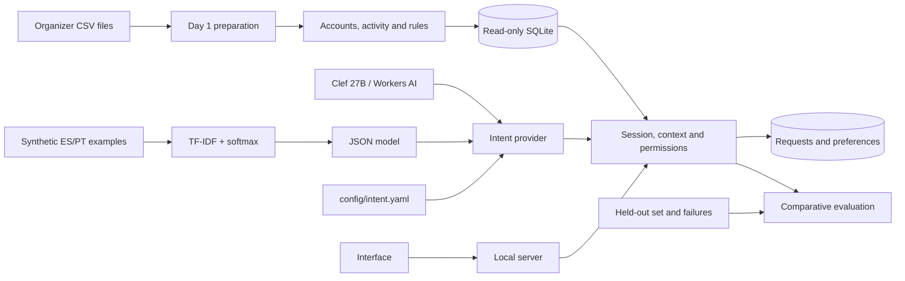

# Relevant campaigns and savings account customer service

A local application whose main workflow is to **select customers, explain inclusions and exclusions, and prepare a confirmed campaign list**. Customers view their information and receive service in Spanish and Portuguese. It includes a trained intent classifier, verifiable sources, and confirmed actions. Scope: **Cuenta Ahorro (savings account), Colombia, historical analysis as of March 1, 2026 at 12:00**, assuming Bogotá time for timestamps without a time zone.

Matching the filters **does not demonstrate financial benefit or actual inactivity**. The catalog contains no approved commercial terms. Queries that require them prepare a request in a local customer service queue. Lists are local; there is no advertising distribution adapter or connection to actual employees.

## Quick demo for hackathon judges (5 minutes)


https://github.com/user-attachments/assets/a7b768cf-326e-4d2a-9940-7df50553f34c


**[Open the deployed app](https://ca-camps-ahorro.politedune-96575e92.northcentralus.azurecontainerapps.io)** — no installation or Azure account is needed. Sign in with these hackathon demo accounts:

| Role | Username | Password |
| --- | --- | --- |
| Campaign operator | `operador` | `ScPJOREpaqG-p9rF1-hnKOz0C4gClcwp9UiVXUaWGaE` |
| Customer | `escenario01` | `G93aZhSWctG10m4q6lmJD1rL0HGgBgA0Y9gICxMuySE` |

1. **Review campaign selection:** log in as `operador`. Browse selected and excluded customers, filter by decision or reason, and open a customer's details to inspect the supporting evidence.
2. **Prepare a campaign list:** click **Preparar lista**, review the audience, then **Confirmar preparación**. Check the confirmation receipt and download the CSV using **Descargar lista**. This prepares a local list; no advertising is sent.
3. **Compare scenarios:** open **Casos de revisión** to inspect the 13 profiles and their expected outcomes, including recent activity, missing consent, and contact-frequency limits.
4. **Test bilingual customer service:** log out and sign in as `escenario01`. Open **Mi información**, then **Atención** and ask “Quiero consultar mis cuentas de ahorro”. Switch the language to Portuguese and ask “Quero consultar minhas contas de poupança”. Responses should use that customer's data and the selected language.
5. **Test explicit confirmation:** ask “Quero falar com um assessor”. Review the proposed request and choose **Confirmar** or **Cancelar**. A confirmed request produces a receipt in the simulated service queue; cancellation should create no request.

The demo uses the organizer's historical data as of **March 1, 2026**. Advisor requests are simulated, and demo actions may reset if the container restarts.

## Architecture



## Run

Requires Python 3.11 or later and the dependencies in `requirements.txt` (NumPy, PyYAML, python-dotenv, and the Azure Identity, Key Vault, and Blob Storage SDKs). On this machine, they can be installed in a local environment using the Codex runtime. If `python` is unavailable, use PowerShell:

```powershell
$ProjectPython = "$env:USERPROFILE\.cache\codex-runtimes\codex-primary-runtime\dependencies\python\python.exe"
& $ProjectPython -m venv --system-site-packages .venv
& .\.venv\Scripts\python.exe -m pip install -r requirements.txt
& .\.venv\Scripts\python.exe scripts/serve.py
```

With Python available on PATH, rebuild from the repository root:

```powershell
python -m pip install -r requirements.txt
python scripts/day1.py build
python scripts/day1.py verify
python scripts/phase2.py build
python scripts/phase2.py verify
python scripts/build_scenarios.py
python -m unittest discover -s tests -v
python scripts/evaluate.py --repeat 2 --regression-run
python scripts/serve.py
```

Preparation reads millions of rows and may take several minutes. If the artifacts are already prepared and verified, `python scripts/serve.py` is sufficient. Open **http://127.0.0.1:8002**. Credentials are in the private file `outputs/app/access_credentials.json`. `operador` reviews campaigns, audiences, and cases; `escenario01` through `escenario13` access their own data. `cliente1` through `cliente3` and their previous passwords are retained. The backend assigns roles and customers; users do not choose an identity in the interface.

The final local model in `outputs/models/intent.json` remains frozen. If only the code is retained without artifacts, `python scripts/train_intents.py` can rebuild it from the team's corpus; that run produces another version and requires documenting its evaluation, without tuning on the exposed held-out set. Clef does not require this local artifact.

The server reads `config/intent.yaml`. Change `intent_classifier.provider` and restart to choose between `tfidf` (**TF-IDF + multinomial logistic regression / softmax**, local and default) and `clef` (**Clef 27B**, Cloudflare Workers AI):

```yaml
schema_version: 1
intent_classifier:
  provider: clef # or tfidf
  router: hybrid
  tfidf:
    model_path: outputs/models/intent.json
  clef:
    timeout_seconds: 15
    confidence_threshold: 0.50
    margin_threshold: 0.10
```

For Clef, set `clef_api_token` and `clef_Account_ID` in the root `.env` file (see `.env.example`). Environment variables take precedence. Credentials are read only when Clef is selected and remain outside YAML and HTTP responses. The token requires Workers AI permissions. The REST endpoint for [`@cf/cloudflare/clef`](https://developers.cloudflare.com/workers-ai/models/clef/) is used with a `choice` question covering the nine existing intents.

For Azure Container Apps, [Key Vault setup and upload instructions](infra/azure/README.md) configure direct access to `kvcampsahorro` through the existing user-assigned managed identity. When `AZURE_KEY_VAULT_URL` is configured, Clef retrieves its credentials with the Azure SDK using `AZURE_CLIENT_ID`. Local environment variables and `.env` remain supported when the vault URL is unset. The Express environment requires SDK retrieval because it does not support native Key Vault references.

The [Azure demo](https://ca-camps-ahorro.politedune-96575e92.northcentralus.azurecontainerapps.io) runs one replica and reads the existing `stlatambank/data` CSVs at container startup. It builds its SQLite working cache inside the container without modifying Storage. The image contains only code; demo logins are private and vault-backed. [Deployment configuration and verification](infra/azure/deployment.md) describe initialization and the agreed ephemeral state lifetime.

`router: hybrid` preserves explicit priorities, rule fallback on abstentions, and clarification on disagreements. `learned` uses the selected provider directly; `baseline` uses only keywords and needs neither a model nor credentials. The response reports `prediction.model_provider` and `routing_source`. Clef thresholds are initial values awaiting a dedicated bilingual evaluation. An invalid response, API error, or timeout produces a controlled failure that allows a retry; it does not automatically switch providers.

The server supports `--config`, `--port`, `--database`, `--model`, `--state`, `--credentials`, `--scenarios`, and `--router hybrid|learned|baseline`. `--router` overrides YAML, and `--model` overrides the local path only with `tfidf`. Model paths specified in YAML are resolved from the repository root when relative. Example: `python scripts/serve.py --config config/intent.yaml`. YAML is loaded at startup; restart after editing it. Ctrl+C stops the server. `config/project.json` and `config/day1.json` still define data rules and dates; YAML controls the customer service classifier.

The instance delivered on this machine is at **http://127.0.0.1:8002**, because port 8000 was occupied. To relaunch it, use `python scripts/serve.py --port 8002` or `& .\.venv\Scripts\python.exe scripts/serve.py --port 8002`.

`data/`, `docs/`, and `outputs/` are excluded from Git. When cloning, copy the organizer's data and documents separately. Original CSV files are never modified. The examples in `datasets/` are synthetic and authored by the team. Do not publish credentials or state databases.

## Review campaigns and customers

1. Log in as `operador`. The main screen shows evaluated, selected, and excluded customers and the reasons. The catalog has five campaigns within scope; one is admitted by the rules and analysis date. Filter decisions and reasons, browse pages, and open a decision's details.
2. **Prepare list** (UI: **Preparar lista**) shows the complete audience; **Confirm preparation** (UI: **Confirmar preparación**) saves all recipients within a transaction and checks the saved IDs. The receipt and CSV download are available only to its operator. No advertising is sent.
3. View **Review cases** (UI: **Casos de revisión**). The catalog reproducibly chooses 13 distinct customers from the organizer's data: selection, recent activity, missing consent, segment, 7/30-day limits, missing account, inconsistent account, future profile, unknown prior activity, account status, quarantined recent transaction, and confirmed advertising opt-out.
4. Log in as `escenario01` to see a candidate with a history; `escenario02` has recent activity; `escenario03` lacks consent. **My information** (UI: **Mi información**) shows consistent accounts and up to five known approved transactions, with dates, types, and IDs. **Customer service** (UI: **Atención**) retains queries and allows customers to ask an advisor for clarification.

The data is fixed. “Latest transactions” means **the latest reliable records known up to the agreed cutoff**, not today's activity. No transactions or customers are fabricated to complete examples. Updates are checked using separate, labeled test fixtures; this is not a live source.

Thirteen profiles broaden manual inspection but do not guarantee coverage of every behavior. Selection is verified against the entire Colombian population, and customer service retains its separate bilingual evaluation.

## Review customer service

1. Log in and submit the Spanish queries “Quiero consultar mis cuentas de ahorro” (I want to view my savings accounts), “Quiero consultar mi actividad reciente” (I want to view my recent activity), and “¿Qué campaña de ahorro puedo consultar?” (Which savings campaign can I view?).
2. Ask “¿Cuáles son las tasas y comisiones de la campaña?” (What are the campaign's rates and fees?). Review the proposed request and click **Confirm** (UI: **Confirmar**) or **Cancel** (UI: **Cancelar**). A receipt appears only after the request is saved and read back.
3. Switch to Portuguese: “Quero consultar minhas contas de poupança” (I want to view my savings accounts) and “Quero falar com um assessor” (I want to speak with an advisor).
4. “No quiero recibir publicidad” (I do not want to receive advertising) proposes a local preference. Confirming it excludes the customer from the operator's audience and preserves customer-requested service.

A `pending` request is recorded in a simulated queue; it does not mean an employee has resolved the banking issue.

## How the code works



| File | Responsibility |
|---|---|
| `config/project.json` | Scope, selection rules, date, and historical assumptions |
| `config/intent.yaml` | TF-IDF/Clef selection, routing, and Clef thresholds |
| `src/campaigns/configuration.py` | YAML loading and validation; Clef credentials from `.env` or the environment |
| `src/campaigns/clef.py` | Clef 27B REST adapter and probability validation |
| `src/campaigns/prepare.py` | Customers, campaigns, and sends; contracts, quality, and provenance |
| `src/campaigns/phase2.py` | Accounts, activity, and selection; recomputes all decisions during verification |
| `src/campaigns/store.py` | Minimal reads and rejection of a replaced database until restart |
| `src/campaigns/intents.py` | Trained classifier, keyword baseline, and hybrid combination |
| `src/campaigns/policy.py` | Permissions, consent, dates, and frequency outside the model |
| `src/campaigns/service.py` | Conversation, grounded responses, clarifications, and confirmed actions |
| `src/campaigns/operations.py` | Operator selection, confirmed preparation, receipts, and local export |
| `src/campaigns/scenarios.py` | Reproducible selection of original profiles with distinct conditions |
| `src/campaigns/server.py` | Local HTTP, request validation, and trusted access assignment |
| `web/index.html` | Campaign center, customer details, and bilingual contextual service |
| `src/campaigns/evaluation.py` | Held-out comparison and verification of persisted outcomes |

Queries first pass through authentication and permissions. The classifier suggests an intent; the workflow decides which data to query. Responses use templates and permitted records. The model neither grants permissions nor invents financial terms. Responses and saved context retain evidence and tool events.

A pending action has a server-generated key. Confirmation rechecks permissions and writes within a SQLite transaction. A subsequent read verifies the outcome before announcing it. Idempotency prevents duplicate requests on retries. A failure rolls back the transaction and retains the pending action for an explicit retry.

A handoff saves the request, verified facts, actions, evidence, unresolved questions, and conversation. Advertising opt-out is a local layer over the prepared audience; it does not alter the dataset.

List preparation works without conversation. `CampaignOperations` requires an operator session, computes all selected pairs, and returns a proposal with a signature covering data, configuration, and recipients. On confirmation, it recomputes the audience, saves the list and members, verifies their identities and metadata, and publishes the receipt. A subsequent opt-out or rule change invalidates the receipt for export (`needs_refresh`). Retries with the same key return the same batch without duplication.

## Selection and data

Campaign `CMP-PHK8DTE4KLJO` targets reactivation, the Basic segment, and the Voice channel. The catalog marks it `Completed`; an explicit exception allows it to be reproduced within its window. There is no proof of its actual historical status.

The rule requires at least one consistent account with `Active` status in the snapshot, known approved activity before the demo, and no observable transaction in the last 30 days. Inconsistent recent records or records available after the demo block that account. The criterion applies per account: another recently active account belonging to the same customer neither proves nor rules out total inactivity.

The current selector is designed for Reactivation. Changing the campaign objective requires defining and testing a new policy; editing a configuration field does not generalize its rules.

Profile and consent are snapshots; not all their historical events exist. Availability is approximated by the processing day. Future events and accounts with inconsistent dates are excluded. Balance, account number, and product rate are not projected because their historical semantics or units have not been verified.

The audience contains **2,021 candidate pairs among 45,251 Colombian customers**. The 1,148 from day 1 used different rules; the difference does not measure a commercial improvement. Exclusion reasons overlap.

Demand evidence can be reproduced with `python scripts/problem_evidence.py`: 686,296 interactions in total and 123,990 from Colombia with consistent dates available at the demo cutoff. Of the latter, 27,238 are in the Product category, 9,894 in Commercial, and 43,394 are flagged for follow-up. These categories support general banking queries and follow-up, without proving demand for this specific campaign. `mentioned_products` references lack consistent ownership when joined with products; they are not used to claim specific savings demand. The savings scope was chosen based on a project decision, the catalog, and available accounts.

The 171,321 supplied transcripts are in Spanish and contain only 546 distinct texts, with template markers. This justifies preparing team-authored bilingual examples rather than treating the transcripts as diverse, reliable labels. `outputs/problem_evidence/` retains aggregates, quality information, and hashes for 2,196 files; it does not export conversations or individual IDs.

## Evaluation

Word and character TF-IDF feeds a local softmax regression. There are 324 training examples and 36 development examples, with ES/PT kept together by family. Vocabulary, IDF, and weights use training data only. Thresholds set using development data: confidence 0.30, margin 0.10, lexical coverage 0.08. The hybrid reports whether it used the model, an explicit rule, or fallback; its results are not attributed entirely to ML.

`scripts/evaluate.py` continues to compare the three frozen local variants; it neither uses the YAML provider nor calls Clef. The following historical metrics correspond to the local model. The Clef integration requires separate quality, latency, and cost measurements before those results can be attributed to it.

The team's independent held-out set contains **48 cases, 24 bilingual families**, frozen before comparison. Twenty cases have a specific intent judgment; the others check policies and failures. Labels have not been validated by the bank. Separation by family and exact text helps prevent leakage; it does not prove absolute semantic independence.

The first comparison measured intent accuracy of 80% for baseline, 85% for learned, and 90% for hybrid. The hybrid workflow passed **44/48**; those failures are preserved. Subsequent workflow corrections passed **48/48 in regression**, with the classifier and thresholds frozen. That repetition is not a new independent evaluation.

Final overall verification passed **79 tests**, including 20 covering selection, lists, failures, and HTTP, and five covering reproducible profiles. In regression, the hybrid automatically resolved 16/38 unique in-scope cases and completed all 6/6 required handoffs. Other cases may pass through clarification, rejection, or controlled failure; 48/48 does not mean all were automatically resolved. Zero unsafe outcomes were observed in 288 runs across the three variants and their repetitions.

| Evidence | Use |
|---|---|
| `outputs/day1/` | Catalog, quality, basic selection, and hashes |
| `outputs/viability_review/` | Additional review of complete data |
| `outputs/problem_evidence/` | Demand by category, date, and country; reference and language limitations |
| `outputs/phase2/` | Audience, SQLite, quality, and full verification |
| `outputs/scenarios/` | Thirteen original profiles, expected conditions, and historical evidence |
| `outputs/verification/requirements_http_review.json` | Independent review of the thirteen logins, data, and HTTP permissions |
| `outputs/models/intent.json` | Weights, splits, metrics, and hashes |
| `outputs/evaluation_first_final/` | Preserved first comparison, including failures |
| `outputs/evaluation/` | Regression, outcomes, transcripts, latency, and costs |
| `docs/final_requirements.json` | PDF requirements; does not by itself declare compliance |

Metrics distinguish safe automatic resolution across all in-scope cases, attempted automation, containment, handoff quality, and unsafe outcomes. Two repetitions are run, and ES/PT samples and segments are reported. Zero observed unsafe errors does not imply zero risk. Final latency sums all service turns in the case, including internal checks; it excludes fixture preparation and rubric assessment, the banking network, and human wait time. The first measurement included evaluation overhead and should not be compared with the corrected one.

In the local evaluation, external APIs cost USD 0; hardware, energy, and local operations are not priced. Clef uses an external API whose consumption depends on Workers AI. Cost per resolution is undefined when there are no resolutions. Conversion, commercial savings, and production improvements have not been measured.

## Updates and operation

Stop the server before updating data or rules. Rebuild and verify day 1 if customers, campaigns, or sends change; rebuild and verify phase 2 if products, transactions, or project rules change. Then run `scripts/build_scenarios.py` to update the catalog. Hashes and inventories are checked. Tests include repeated loads, late arrivals, and conflicting keys inside and outside scope. The temporary file is published after validation. Restart to load the new version; pending actions from an earlier version are rejected. If the identity assigned to a scenario user changes, use new state and credential files; do not reassign an existing login to another customer.

This is a single local process with locking for state operations; banking-scale capacity has not been tested. Messages: up to 2,000 characters. Sessions: 30 actual minutes, independent of the historical date. SQL queries are parameterized. Automatic tool retries: zero; users may explicitly retry with the same key. A failure never authorizes a send.

Real operation still requires institutional identity, approved terms and policies, human review of labels and rules, authorized integrations, TLS, secret management, monitoring, and load testing. The local audit records actions/outcomes, and evaluation retains timings/transcripts. With `tfidf`, inference is local. With `clef`, the message being classified and intent descriptions are sent to Cloudflare; the adapter does not attach accounts, balances, credentials, or conversation history.

Local retention: the last 12 messages per conversation; sessions expire after 30 minutes. Requests, preferences, lists, and audit records remain until state is deleted. With the server stopped, manually archive or delete state and credentials after trials according to the organizer's rules. This removes local records without affecting CSV files. Real operation requires an approved retention and deletion policy.
